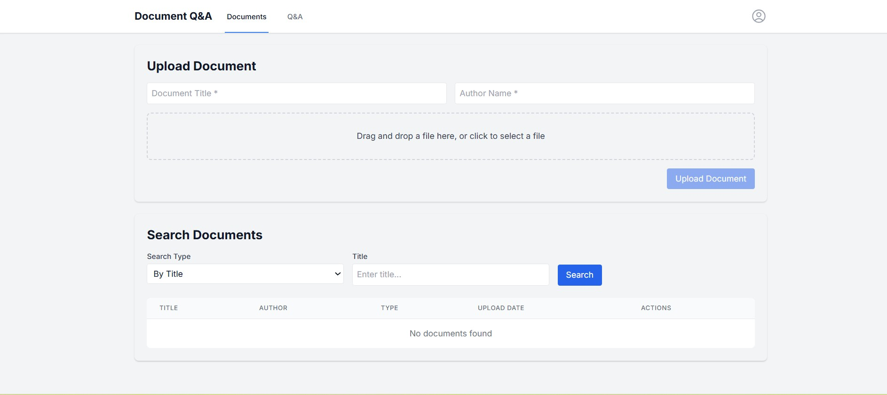
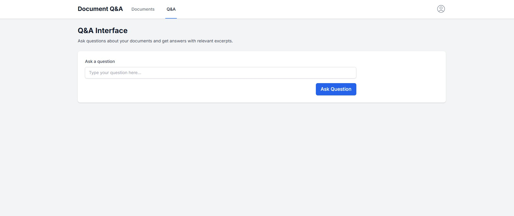

# Document Ingestion System

A comprehensive document management system that allows users to upload, process, search and manage documents of various formats (PDF, DOCX, etc.).

## Features

The system is built with a modern, scalable architecture that provides the following features:

#### Backend Services (Spring Boot)
- **Document Management**: 
  - Upload, retrieve, and delete documents
  - Secure file storage with metadata tracking
  - Support for multiple document formats (PDF, DOCX, etc)
- **Authentication & Authorization**: 
  - JWT-based authentication and Role-based access control

#### Search & Processing (Elasticsearch & Kafka)
  - Full-text search across document content powered by **Elasticsearch**
  - Search by title, author, and document type
  - Background document processing via **Kafka**

#### Data Storage & Caching
  - Document metadata and User storage in **PostgreSQL Database**
  - High-performance caching layer using **Redis**

### System Architecture

```
                         ┌───────────────────┐
                         │     Next.js       │
                         │     Frontend      │
                         └────────┬──────────┘
                                  │
                                  ▼
                         ┌───────────────────┐
                         │   Spring Boot     │
                         │     Backend       │
                         └────────┬──────────┘
                                  │
       ┌──────────────────────────┼────────────────────────┐
       ▼                          ▼                        ▼
┌─────────────┐        ┌───────────────────┐       ┌────────────────────┐
│   Redis     │        │     Kafka         │       │                    │
│   Cache     │        │   Message Broker  │       │                    │
└────┬────────┘        └─────────┬─────────┘       │                    │
     │                           │                 │   Elasticsearch    │
     ▼                           ▼                 │                    │
┌─────────────┐           ┌───────────────┐        │                    │
│ PostgreSQL  │           │ KafkaListener │────────▶                    │
│  Database   │           │ (Async Logic) │        └────────────────────┘
└─────────────┘           └───────────────┘

```

### Frontend

#### 1. Document Upload & Management

*Upload and manage documents with an intuitive interface*

#### 2. Q&A

*Search in documents content*

#### 3. Secirity


## Prerequisites

- Java 21 or higher
- Maven
- Docker and Docker Compose
- Node.js and npm

## Running on Docker

### 1. Clone the repository

```
git clone https://github.com/amitkc2309/document-ingestion
```

### 2. Build Image for backend service

```
cd di-backend
mvn compile jib:dockerBuild
```

### 3. Build Image for Frontend

```
cd di-frontend
docker build --no-cache -t amitking2309/document-ingestion-ui .
```

### 4. Start the docker services

```
cd di-docker
docker-compose up -d
```

This will start PostgreSQL, Kafka, Elasticsearch, Redis, backend and frontend services.

The application will be available at http://localhost:3000  
Register a user then login to interact with the application.

## API Documentation

Once the application is running, you can access the Swagger UI at:

```
http://localhost:8080/swagger-ui.html
```

## API Endpoints

### Authentication

- `POST /api/auth/register` - Register a new user
- `POST /api/auth/login` - Login a user
- `POST /api/auth/logout` - Logout a user

### Document Management

- `POST /api/documents/upload` - Upload a document (requires ADMIN or EDITOR role)
- `GET /api/documents/{id}` - Get document by ID
- `DELETE /api/documents/{id}` - Delete document (requires ADMIN or EDITOR role)
- `GET /api/documents/by-author` - Find documents by author
- `GET /api/documents/by-title` - Find documents by title
- `GET /api/documents/by-type` - Find documents by type

### Question & Answer

- `POST /api/qa/ask` - Ask a question and get relevant document snippets

